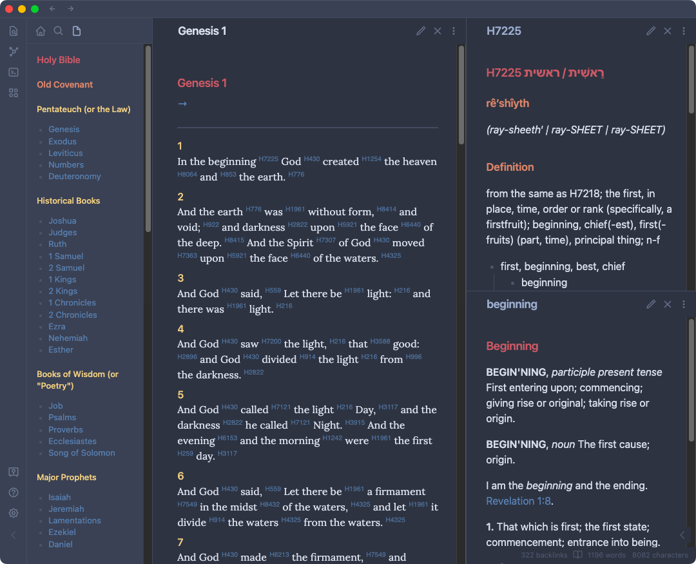
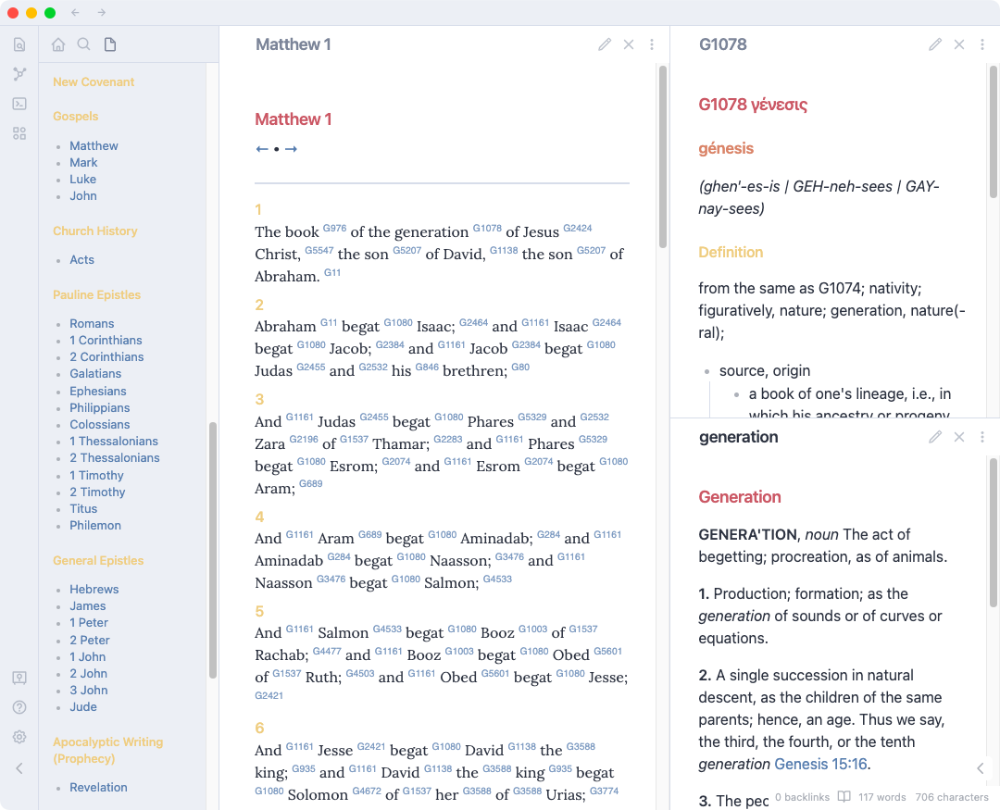

# Kingdom Study Tools for [Obsidian](https://obsidian.md)

## Tools available:

- Holy Bible (KJV)
	- w/ Strong's numbers linking to lexicon definitions
	- w/ Obsidian frontmatter(YAML) "cssClasses" defined for custom css styles (see [custom.css](resources/custom.css) for example)
	- compatible with [Bible Linker](https://github.com/kuchejak/obsidian-bible-linker-plugin) by [@kuchejak](https://github.com/kuchejak)
- Both Hebrew & Greek Lexicons w/ Strong's numbers
	- w/ links to other verses & parallel definitions
- Noah Webster's 1828 American Dictionary of the English Language
	- w/ links to Bible verses & related definitions

## Screenshots

> Example screenshots presented w/ [Minimal Theme](https://github.com/kepano/obsidian-minimal) by [@kepano](https://github.com/kepano) using the "Nord" color scheme & "Colorful Headings" setting.

## Etc.

The Bible texts, grammatical data, Greek and Hebrew lexicons are derived from the [BibleForge](https://github.com/bibleforge/BibleForgeDB) project.

The texts of the King James Bible, the original Greek and Hebrew, the Greek and Hebrew Lexicons,and all other related data, such as the Strong's numbers and grammatical information, are in the public domain.

Noah Webster's 1828 American Dictionary of the English Language is in the public domain